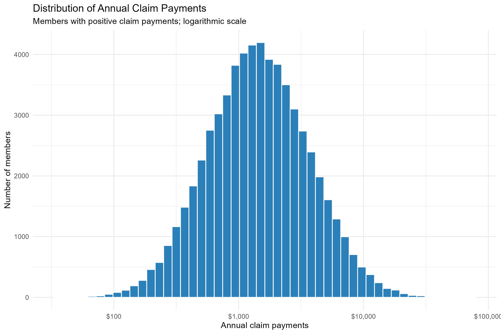
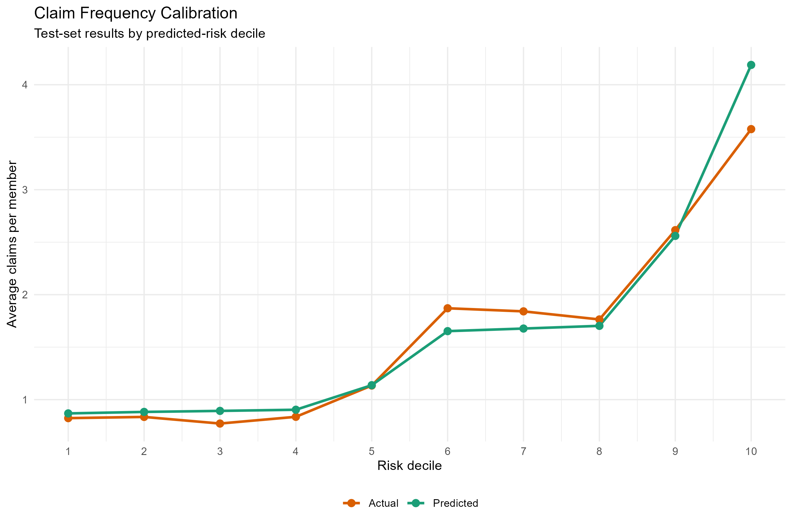
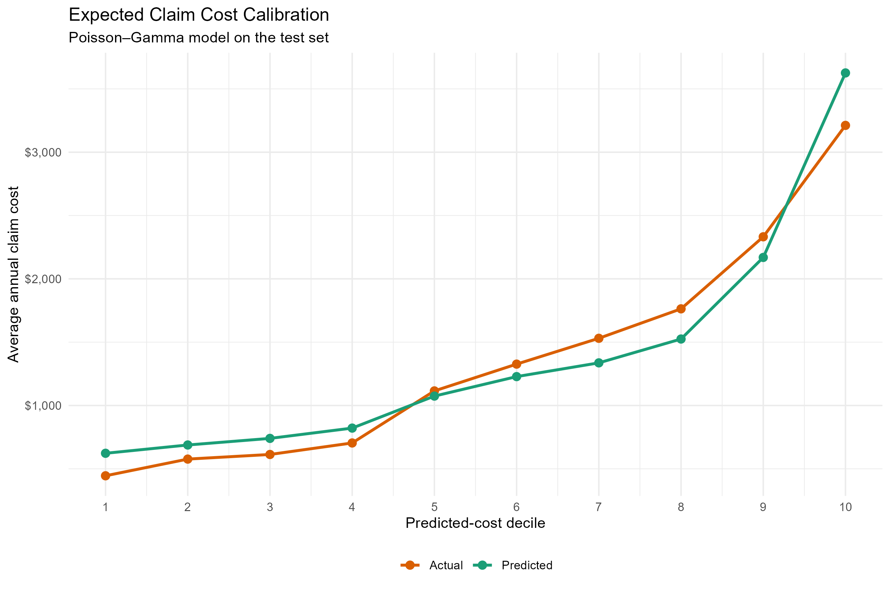

# Health Insurance Claims and Pricing Analysis

**SQL data validation • R generalised linear models • Frequency–severity analysis • Model evaluation**

This project estimates member-level claim costs by modelling how often claims occur and how much they cost. It demonstrates an actuarial workflow from data checks and portfolio analysis to model comparison and interpretation.

On a 20,000-member evaluation sample, the Poisson–Gamma model reduced mean absolute error by **11.0%** and root mean squared error by **6.6%** compared with assigning every member the training portfolio's average cost. Its predicted average cost was **1.6% above** the observed average. Calibration by risk group reveals weaknesses that the overall average alone would hide.

## Business question

Can member and plan characteristics improve expected claim-cost estimates beyond a single portfolio average?

The output is an expected claims-cost estimate, a starting point for pricing analysis. It is not a quoted premium: expenses, commissions, profit, capital, inflation and other pricing adjustments have not been added.

## Data and scope

- **Source:** [Medical Insurance Cost Prediction, published by Mohan Krishna Thalla on Kaggle](https://www.kaggle.com/datasets/mohankrishnathalla/medical-insurance-cost-prediction).
- **Size:** 100,000 records with unique `person_id` values; 54 source columns plus the SQL-derived `has_claim` indicator.
- **Outcomes:** `claims_count`, `avg_claim_amount` and `total_claims_paid`.
- **Tools:** DB Browser for SQLite, R/RStudio, tidyverse and MASS.

This is an educational dataset, not a verified Canadian insurer portfolio. Its collection or generation process has not been independently established in this project. Currency and the exact claims observation period are not established by the available documentation. Dollar symbols are display formatting, not an assertion that the amounts are CAD.

For this exercise, claims are treated as covering a common annual observation period. There is no verified member-year exposure measure, so no exposure offset is used. `policy_term_years` is not assumed to be observed claims exposure.

## SQL preparation

The SQL scripts inspect the source table, check data quality, calculate portfolio summaries and create the `health_analysis_base` view for export to R.

Checks returned no issues for:

- Missing or duplicate member IDs.
- Missing key financial fields, negative financial amounts, and negative or fractional claim counts.
- Annual versus monthly premium consistency within a rounding tolerance.
- Zero-count versus zero-payment consistency.
- Agreement between claim count × average claim amount and total claims paid within a rounding tolerance.

These are internal consistency checks; they do not establish that every demographic combination is realistic. The scripts also inspect age, plan categories and policy terms.

## Portfolio exploration

| Measure | Result |
|---|---:|
| Members with at least one claim | 62.34% |
| Claims per member | 1.622 |
| Average total claims paid per member | $1,377.88 |
| Median total claims paid per member | $642.55 |
| 99th percentile of total claims paid | $10,564.56 |
| Maximum total claims paid | $72,517.95 |

Payments are strongly right-skewed. The chart below excludes zero-payment members and uses a logarithmic x-axis; a roughly bell-shaped appearance on this scale does not imply normally distributed original payments.



The calculated ratio of total claims paid to annual premiums is **236.62%**. It is an illustrative paid-to-premium ratio, not a validated accounting loss ratio: matched coverage periods, earned premiums and incurred claims are unavailable. It should not be interpreted as evidence about real insurer profitability.

## Modelling approach

An 80% training / 20% evaluation split uses `set.seed(2026)`. All baseline predictions are estimated from training data only.

Both frequency models use age, sex, region, urban/rural category, BMI, smoking status, chronic-condition count, plan type, network tier, deductible and copay. The severity model uses the same predictors. Outcome-derived fields such as `has_claim`, `total_claims_paid` and `avg_claim_amount` are excluded from predictors.

### Claim frequency

A Poisson GLM and a negative binomial GLM are fitted with log links. Portfolio claim counts have mean **1.622** and variance **4.120**, motivating investigation of overdispersion.

| Model | Training AIC | Evaluation MAE | Evaluation RMSE |
|---|---:|---:|---:|
| Constant training-mean baseline | — | 1.486 | 2.008 |
| Poisson GLM | 279,165.4 | 1.296 | 1.795 |
| Negative binomial GLM | 261,784.2 | 1.307 | 1.819 |

The negative binomial has a substantially lower training AIC, supporting a better distributional fit after accounting for its extra parameter. The Poisson has slightly lower evaluation errors for predicted mean counts. These assess different aspects of model performance.

The negative binomial calibration chart groups members into ten equally sized groups by predicted frequency. Observed frequency increases from **0.824** in the lowest group to **3.577** in the highest. However, the highest group's prediction is **4.188**, approximately 17% above its observed average.



### Claim severity

A Gamma GLM with a log link is fitted to members with positive claims, using `avg_claim_amount` as the response and `claims_count` as the weight. Count weighting gives more influence to member averages supported by more claims; it assumes that these averages carry more information.

| Model | Predicted weighted mean | Weighted MAE | Weighted RMSE |
|---|---:|---:|---:|
| Training claim-weighted mean baseline | $850.15 | $607.90 | $969.84 |
| Gamma GLM | $847.47 | $594.04 | $954.58 |

Observed weighted mean severity is **$847.41**. The Gamma model improves weighted MAE by **2.3%** and weighted RMSE by **1.6%**. These errors assess claim-weighted **member average severities**, not individual claim transactions, which are unavailable.

### Combined expected claim cost

Expected member cost = predicted claim count × predicted claim severity.

| Model | Predicted mean cost | MAE | RMSE |
|---|---:|---:|---:|
| Training-mean cost baseline | $1,381.90 | $1,401.90 | $2,219.39 |
| Poisson × Gamma | $1,383.06 | $1,248.27 | $2,073.98 |
| Negative binomial × Gamma | $1,401.76 | $1,255.77 | $2,096.76 |

Observed mean cost is **$1,361.78**. Poisson × Gamma is the preferred candidate for expected-cost point predictions in this comparison.



The cost model separates risk: observed average cost ranges from **$444.85** to **$3,211.86** across the lowest and highest groups. Nevertheless, it overpredicts the lowest group by about **40%** and the highest by about **13%**, while underpredicting several middle-to-upper groups. Good portfolio-level agreement therefore does not mean good calibration for every segment.

## Limitations and next steps

- Results demonstrate methods on an educational dataset and do not establish causal effects or Canadian pricing relationships.
- Predictor timing is not verified. Prospective use would require confirming that every predictor is available before the claims period.
- The same evaluation sample was used to compare and select models. Reported errors are exploratory; an untouched final test set or cross-validation would strengthen assessment.
- Claim-count weights and the frequency–severity structure are modelling assumptions. Transaction-level claims and exposure data would allow stronger validation.
- Future work could examine nonlinear age/BMI effects and segment calibration using training/validation data, then assess the final model on fresh data.
- Real pricing would also require benefit definitions, claims development, trend assumptions and review of which rating factors are appropriate and permitted.

## Reproduce the project

### 1. Prepare the data with SQLite

Download `medical_insurance.csv` from the source above. In DB Browser for SQLite, create a database and import the CSV as table **`health_insurance`**, using its first row as column names.

Run `02_health_validation.sql`, followed by `03_health_portfolio_analysis.sql`. The latter creates the `health_analysis_base` view. On an existing database where this view already exists, skip that `CREATE VIEW` statement; the current script creates it once.

Export **all rows of the view** to `health_analysis_base.csv` in the project folder. Do not export the ten-row inspection query.

### 2. Run the R analysis

Open `Health Insurance Project.Rproj` in RStudio. Install dependencies once if needed:

```r
install.packages(c("tidyverse", "MASS"))
```

With the project folder as the working directory, run:

```r
source("01_data_import_validation.R")
```

Despite its original filename, this script contains the complete R workflow: import, exploration, modelling, evaluation and exports. It regenerates **three PNG charts and eight CSV result tables** in `outputs/`. It does not require a saved `.RData` workspace. Numerical results may vary slightly across R or package versions; this project was developed with R 4.2.2.

## Files

| File | Purpose |
|---|---|
| `health_insurance_checks.sql` | Initial data inspection and exploratory checks |
| `02_health_validation.sql` | Record and financial consistency checks |
| `03_health_portfolio_analysis.sql` | Portfolio summaries and analysis-view creation |
| `01_data_import_validation.R` | Complete R analysis and output generation |
| `Health Insurance Project.Rproj` | RStudio project settings |
| `outputs/` | Model comparisons, baseline comparisons, calibration tables and charts |

Raw data, the SQLite database and the exported member-level CSV are local inputs. Obtain the data from the linked source and follow the preparation steps to reproduce the analysis.
